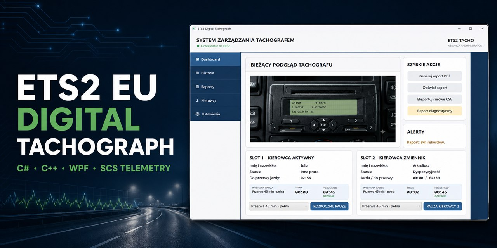
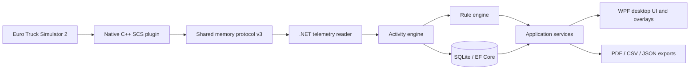

# ETS2 EU Digital Tachograph

<p align="center">
  <strong>A Windows desktop application and native telemetry plugin that turns live Euro Truck Simulator 2 data into an auditable driver-activity history, EU-style driving-time analysis, and printable reports.</strong>
</p>

<p align="center">
  <a href="https://github.com/Staniek-Tech-NL/ETS2-EU-Digital-Tachograph/actions/workflows/ci.yml"></a>
  <a href="https://github.com/Staniek-Tech-NL/ETS2-EU-Digital-Tachograph/releases/latest"></a>
  <a href="LICENSE"></a>
</p>

<p align="center">
  <a href="https://github.com/Staniek-Tech-NL/ETS2-EU-Digital-Tachograph/releases/latest"><strong>Download</strong></a>
  · <a href="docs/DOCUMENTATION.md"><strong>Documentation</strong></a>
  · <a href="docs/ARCHITECTURE.md"><strong>Architecture</strong></a>
  · <a href="docs/ENGINEERING_CASE_STUDY.md"><strong>Engineering case study</strong></a>
</p>

<p align="center">
  <a href="README_PL.md">Polski</a> · <strong>English</strong>
</p>



> [!IMPORTANT]
> This project is an ETS2 simulator. It is not a certified tachograph and must
> not be used to account for the working time of real drivers.

## Why I built this

I wanted to build a desktop product around a genuinely difficult engineering
problem: combining live native telemetry, time-based domain rules, durable
history, and an interface that remains useful during gameplay. The result is a
mixed C# and C++ system rather than a conventional CRUD application.

## Engineering highlights

- Mixed C#/.NET 9 and native C++ solution using the official SCS SDK 1.14.
- Versioned 32-byte shared-memory protocol with explicit compatibility checks.
- Event-driven reconstruction of driver activity across game-time rollbacks.
- Rule engine for continuous driving, breaks, daily/weekly rest, and
  multi-manning within the simulator's implemented scope.
- SQLite and EF Core persistence with migrations and pre-migration backups.
- Layered retention model: minute-level recent history and compact older blocks.
- PDF, CSV, `.tacho`, and VTC JSON reporting.
- 570-test M6 release gate covering domain, application, persistence,
  telemetry, reporting, and UI-facing behaviour.
- Windows GitHub Actions pipeline with Release build, tests, TRX results, and
  Cobertura coverage artifacts.

## What the application does

| Capability | Implementation |
|---|---|
| Live activity capture | Reads official ETS2 telemetry and detects driving automatically. |
| Two-driver operation | Models two card slots, card swaps, and multi-manning scenarios. |
| Driving-time analysis | Calculates continuous, daily, weekly, and fortnightly counters. |
| History reconstruction | Preserves one logical timeline through clock rollbacks and world reloads. |
| Durable storage | Stores activity in SQLite and protects migrations with automatic backups. |
| Reporting | Produces readable PDF blocks plus diagnostic CSV and JSON exports. |

## System at a glance



See the [architecture document](docs/ARCHITECTURE.md) for component boundaries,
data flow, invariants, and failure handling.

## Product preview

### Dashboard


### In-game overlay


### Readable PDF report


## Download and installation

The current public build is
[`0.1.0-beta.12`](https://github.com/Staniek-Tech-NL/ETS2-EU-Digital-Tachograph/releases/tag/v0.1.0-beta.12),
published as a self-contained Windows x64 pre-release.

1. Download the application package from [Releases](https://github.com/Staniek-Tech-NL/ETS2-EU-Digital-Tachograph/releases/latest).
2. Copy `ETS2Tachograph.ScsPlugin.dll` to the ETS2 `bin\win_x64\plugins`
   directory.
3. Run `ETS2Tachograph.Desktop.exe` from the application directory.

Read the complete [English installation guide](docs/INSTALLATION_EN.md) or the
[Polish installation guide](docs/INSTALLATION_PL.md) before first use.

## Build and test

Requirements:

- .NET SDK `9.0.311`;
- Visual Studio 2022 with **Desktop development with C++**;
- Windows SDK;
- official SCS SDK 1.14 headers under `third_party/scs_sdk_1_14`.

```powershell
dotnet restore ETS2Tachograph.sln
dotnet build ETS2Tachograph.sln --configuration Release --no-restore
dotnet test ETS2Tachograph.sln --configuration Release --no-build
```

The native plugin is built separately as `Release|x64` from
`native/ETS2Tachograph.ScsPlugin/ETS2Tachograph.ScsPlugin.vcxproj`.

## Documentation

- [Documentation index](docs/DOCUMENTATION.md)
- [Architecture](docs/ARCHITECTURE.md)
- [Engineering case study](docs/ENGINEERING_CASE_STUDY.md)
- [English user guide](docs/USER_GUIDE_EN.md)
- [Known issues](KNOWN_ISSUES_EN.md)
- [Security policy](SECURITY.md)
- [Support](SUPPORT.md)

## Technical debt and next steps

The product is deliberately presented with its current trade-offs. The largest
maintenance items are splitting the oversized `MainViewModel` into feature
view models and separating the broad persistence repository file into focused
repositories. These refactors are planned, but they are not required to hide a
known correctness problem in the current release.

## License

Original project code is licensed under the [MIT License](LICENSE). Third-party
components remain subject to their own terms listed in
[THIRD_PARTY_NOTICES.md](docs/THIRD_PARTY_NOTICES.md). Third-party names and
trademarks remain the property of their respective owners.
