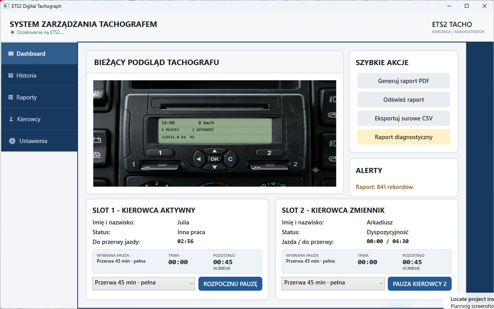
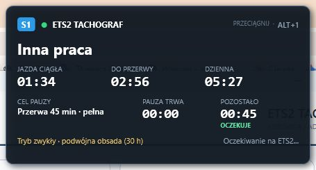
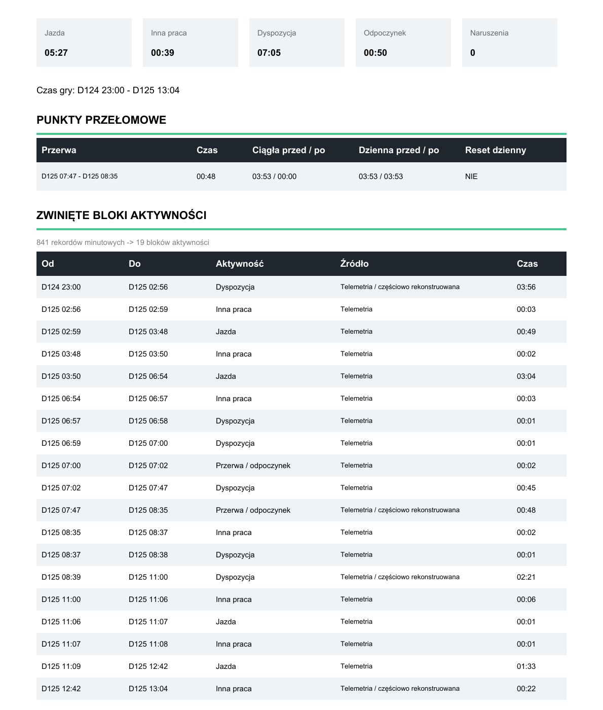
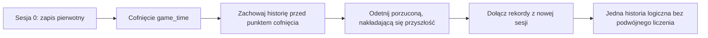

# ETS2 EU Digital Tachograph

Symulator europejskiego tachografu cyfrowego dla Euro Truck Simulator 2. Aplikacja
czyta oficjalną telemetrię SCS, buduje historię w czasie gry, obsługuje dwie karty
kierowców i wylicza liczniki zgodnie z zaimplementowanym zakresem reguł.

> Projekt jest symulatorem do ETS2. Nie jest certyfikowanym tachografem ani
> narzędziem do rozliczania rzeczywistego czasu pracy kierowcy.

## Aktualny stan

- opublikowaną bazą wersjonowaną pozostaje `0.1.0-beta.11.1`;
- bieżące zmiany UI są wdrożone wyłącznie lokalnie i nie tworzą nowej wersji beta;
- lokalny gate Release: **310/310 testów**, 0 błędów i 0 ostrzeżeń;
- aplikacja została uruchomiona diagnostycznie po ostatnich zmianach XAML.

## Podgląd

### Panel główny



### Nakładka w grze - slot 1



### Czytelny raport PDF



## Najważniejsze funkcje

- telemetria z oficjalnego SCS SDK 1.14;
- automatyczne wykrywanie jazdy oraz ręczny wybór pracy, dyspozycyjności i odpoczynku;
- dwa sloty kart oraz zmiana kierowcy przez wyjęcie i włożenie kart do przeciwnych slotów;
- 45-minutowa przerwa drugiego kierowcy podczas jazdy;
- liczniki jazdy ciągłej, dziennej, tygodniowej i dwutygodniowej;
- odpoczynek dzienny, tygodniowy, tryb podwójnej obsady, OUT i prom;
- przeszukiwalny wybór kraju rozpoczęcia i zakończenia z pełnego katalogu
  ISO 3166-1 alpha-2; historia przechowuje ISO, a LCD używa osobnego kodu
  tachografowego;
- wizualny edytor wpisu manualnego: pełny plan luki, szybkie akcje, segmenty
  odpoczynku, pracy i dyspozycyjności, automatyczne dzielenie oraz scalanie;
- licznik `ODP. TYG.` prezentowany jako liczba zakończonych okresów 24 h
  z dokładnym czasem telemetrycznym, np. `3/6 (89:39)`;
- nakładki `S1` i `S2`, zapamiętujące osobne położenie;
- trwała baza SQLite, import/eksport `.tacho`, surowy CSV, VTC JSON i raport PDF;
- raport diagnostyczny ZIP do beta-testów;
- automatyczny backup bazy przed każdą migracją;
- blokada uruchomienia drugiej instancji aplikacji i monitora;
- alarm przy niezgodnej wersji protokołu pluginu.

## Skróty nakładek

- `Alt+1` - pokaż lub ukryj liczniki karty w slocie 1 (`S1`);
- `Alt+2` - pokaż lub ukryj liczniki karty w slocie 2 (`S2`);
- `Alt+Q` - dodatkowy skrót dla `S1`.

Nakładkę można przeciągnąć za górny pasek. Pozycje obu nakładek są zapisywane
oddzielnie i przywracane po kolejnym uruchomieniu.

## Instalacja

### 1. Plugin SCS

1. Zamknij ETS2.
2. Znajdź `ETS2Tachograph.ScsPlugin.dll` w katalogu `plugin` paczki.
3. Jeżeli DLL pochodzi z pobranego ZIP-a, kliknij plik prawym przyciskiem,
   wybierz **Właściwości**, zaznacz **Odblokuj** i zatwierdź.
4. Skopiuj DLL do:

   ```text
   Euro Truck Simulator 2\bin\win_x64\plugins\
   ```

5. Uruchom ETS2 i zaakceptuj komunikat o użyciu SDK.

Najczęstsza ścieżka Steam:

```text
C:\Program Files (x86)\Steam\steamapps\common\Euro Truck Simulator 2\bin\win_x64\plugins\
```

Po podmianie pluginu trzeba ponownie uruchomić grę. Dewelopersko można użyć
polecenia konsoli `sdk reload`.

### 2. Aplikacja

Uruchom `ETS2Tachograph.Desktop.exe` z katalogu aplikacji. Jest to publikacja
self-contained, dlatego tester nie musi osobno instalować .NET.

Jeżeli aplikacja wykryje inną wersję protokołu pluginu, pokaże błąd zawierający
wersję wykrytą i oczekiwaną. Nie należy wtedy kontynuować testu na starej DLL.

## Dane użytkownika

Aplikacja przechowuje dane w:

```text
%LocalAppData%\ETS2Tachograph\
```

Najważniejsze pliki i katalogi:

- `tachograph.db` - główna baza SQLite;
- `tachograph.db.bak.RRRRMMDD-GGMMSS-fff` - automatyczne kopie sprzed migracji;
- `Logs\tachograph-RRRR-MM-DD.log` - logi diagnostyczne;
- `Printouts\` - wydruki urządzenia;
- ustawienia nakładek są zapisywane osobno dla `S1` i `S2`.

## Czas gry i cofanie zegara

Cała historia działa na `game_time` z ETS2, a nie na zegarze Windows. Sen,
`g_set_time` i niektóre korekty pozycji mogą przesunąć czas gry do przodu lub do
tyłu. Cofnięcie tworzy kolejną sesję historii.

Historia logiczna jest składana metodą `truncate-and-append`:



Przykład regresyjny: pierwsza gałąź zawiera `03:53` jazdy, a druga dopisuje
`01:34` po cofnięciu. Wynik logiczny wynosi `05:27`, bez utraty wcześniejszej
historii i bez podwójnego policzenia nakładania.

## Retencja historii

Baza pozostaje źródłem prawdy o minutach gry. Dane są prezentowane warstwowo:

- ostatnie 14 dni gry - pełne rekordy minutowe używane przez RuleEngine;
- starsze dane - ciągłe bloki tej samej aktywności; zmiana źródła daje `Mixed`,
  ale nie rozcina bloku;
- warstwa dobowa po 365 dniach ma przygotowany hak architektoniczny, lecz nie jest
  jeszcze implementowana.

Próg 14 dni jest liczony od monotonicznego `highWaterMark`, więc cofnięcie czasu
gry nie odmładza zarchiwizowanych rekordów. PDF pokazuje bloki, natomiast surowy
CSV pozostaje minutowy do diagnostyki.

## Historia najważniejszych problemów

- Stara DLL pluginu potrafiła wyglądać jak poprawnie działająca telemetria. Dlatego
  protokół ma wersję, a niezgodność jest teraz zgłaszana wprost.
- Cofnięcie czasu powodowało kiedyś utratę pierwszej części jazdy i wynik `01:34`
  zamiast `05:27`. Model sesji i test `truncate-and-append` chronią tę regresję.
- Raport minuta po minucie tworzył ponad 40 stron na dobę gry. Baza nadal zachowuje
  minuty, ale PDF agreguje je w czytelne bloki.
- Ramki z `running == 0` mogły zawierać `game_time = 0`. Są ignorowane przez zapis,
  high-water mark i konsolowy monitor.

## Protokół telemetrii v3

Blok shared memory v3 ma 32 bajty i publikuje `world_generation`. Plugin zwiększa
go po fladze SCS `frame_start.timer_restart`. Pierwsza wartość jest tylko punktem
odniesienia; późniejsza zmiana tworzy wspólną granicę sesji obu kart, również gdy
wczytany czas gry jest identyczny albo późniejszy. Zmiana zauważona podczas pauzy
jest zapisywana na pierwszej aktywnej ramce.

Pole `cargo_operation_generation` jest zwiększane po załadunku i rozładunku na
podstawie oficjalnych zdarzeń SCS. Dzięki temu kontrolowany skok czasu gry jest
zapisywany według aktywności wybranej na danej karcie, zamiast jako nierozliczona
luka.

Nowa mapa nazywa się `Local\ETS2Tachograph.Telemetry.v3`. Czytnik sprawdza też
starszą mapę `.v2`, aby zgłosić czytelny błąd niezgodnej DLL.

## Budowanie i testy

Wymagania deweloperskie:

- .NET SDK 9;
- Visual Studio 2022 z komponentem **Desktop development with C++**;
- Windows SDK;
- oficjalne nagłówki SCS SDK 1.14 znajdujące się w `third_party/scs_sdk_1_14`.

```powershell
dotnet restore
dotnet build ETS2Tachograph.sln --configuration Release
dotnet test ETS2Tachograph.sln --configuration Release
```

Aktualny podział testów:

```text
Core 33 · Telemetry.Scs 8 · Engine 69 · RuleEngine 62
Application 50 · Reports 9 · Infrastructure 51 · Desktop 28
Razem 310
```

Plugin należy zbudować jako `Release|x64` z projektu
`native/ETS2Tachograph.ScsPlugin/ETS2Tachograph.ScsPlugin.vcxproj`.

## Struktura

- `src/ETS2Tachograph.Core` - model domenowy i reguła jednej minuty;
- `src/ETS2Tachograph.Telemetry.Scs` - odczyt shared memory;
- `src/ETS2Tachograph.Engine` - przetwarzanie ramek i historia;
- `src/ETS2Tachograph.RuleEngine` - liczniki i naruszenia;
- `src/ETS2Tachograph.Infrastructure` - SQLite, EF Core i retencja;
- `src/ETS2Tachograph.Application` - serwisy aplikacyjne;
- `src/ETS2Tachograph.Reports` - raporty i eksport;
- `src/ETS2Tachograph.Desktop` - WPF i nakładki;
- `native/ETS2Tachograph.ScsPlugin` - natywny plugin SCS x64;
- `tests` - testy jednostkowe, integracyjne i regresyjne.

## Ograniczenia

Aktualna lista znajduje się w [KNOWN_ISSUES.md](KNOWN_ISSUES.md). Przed zgłoszeniem
błędu warto wygenerować w aplikacji **Raport diagnostyczny** i dołączyć ZIP.
