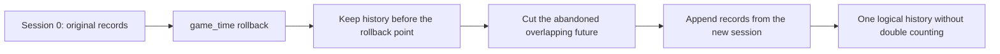

# ETS2 EU Digital Tachograph

[](https://github.com/Staniek-Tech-NL/ETS2-EU-Digital-Tachograph/actions/workflows/ci.yml)

[Polski](README.md) | [English](README_EN.md)

A European digital tachograph simulator for Euro Truck Simulator 2. The
application reads official SCS telemetry, builds activity history in game time,
supports two driver cards, and calculates counters within the implemented rule
set.

> This project is an ETS2 simulator. It is not a certified tachograph and must
> not be used to account for the working time of real drivers.

## Current status

- the current release is
  [`0.1.0-beta.12`](https://github.com/Staniek-Tech-NL/ETS2-EU-Digital-Tachograph/releases/tag/v0.1.0-beta.12),
  published as a pre-release on 5 August 2026 with an **M8 GO** decision;
- the complete M7 smoke test passed with no open P0/P1 defects;
- `0.1.0-beta.11.1` remains available as a historical version;
- the M6 gate passed **570/570 tests**, with 0 Release build errors and
  0 warnings, using `FileVersion 0.1.12.0`;
- the M5.2-P startup correctness and performance checkpoint received **GO**.

## Preview

### Dashboard


### In-game overlay — slot 1


### Readable PDF report


## Key features

- telemetry from the official SCS SDK 1.14;
- automatic driving detection and manual selection of work, availability, and
  rest;
- two card slots, including driver changes by removing and inserting cards into
  the opposite slots;
- a 45-minute break for the second driver while the vehicle is moving;
- continuous, daily, weekly, and fortnightly driving counters;
- daily and weekly rest, multi-manning, OUT, and ferry modes;
- searchable start/end country selection from the complete ISO 3166-1 alpha-2
  catalogue; history stores ISO codes while the LCD uses a separate tachograph
  code;
- visual manual-entry editor with a complete gap plan, quick actions, rest,
  work, and availability segments, automatic splitting, and merging;
- the weekly-rest counter shows the current 24-hour period and a fixed deadline
  for starting rest in `game_time`, for example `4/6 (D141 22:55)`;
- Dashboard, device, and overlay break targets use the current continuous
  `BreakOrRest` block qualified by RuleEngine;
- independent `S1` and `S2` overlays with separately saved positions;
- persistent SQLite database, `.tacho` import/export, raw CSV, VTC JSON, and PDF
  reports;
- diagnostic ZIP for beta testing and issue reports;
- automatic database backup before every migration;
- protection against running a second application or monitor instance;
- a clear warning when the plugin protocol version does not match.

## Overlay shortcuts

- `Alt+1` — show or hide the card counters for slot 1 (`S1`);
- `Alt+2` — show or hide the card counters for slot 2 (`S2`);
- `Alt+Q` — additional shortcut for `S1`.

Drag an overlay by its top bar. Positions for both overlays are stored
independently and restored on the next launch.

## Installation

Complete instructions:

- [PL/EN documentation index](docs/DOCUMENTATION.md);
- [installation in English](docs/INSTALLATION_EN.md);
- [instalacja po polsku](docs/INSTALLATION_PL.md);
- [basic user guide in English](docs/USER_GUIDE_EN.md);
- [podstawowa instrukcja użytkowa po polsku](docs/USER_GUIDE_PL.md).

### 1. SCS plugin

1. Close ETS2.
2. Find `ETS2Tachograph.ScsPlugin.dll` in the package's `plugin` directory.
3. If the DLL came from a downloaded ZIP, right-click it, select
   **Properties**, enable **Unblock**, and confirm.
4. Copy the DLL to:

   ```text
   Euro Truck Simulator 2\bin\win_x64\plugins\
   ```

5. Start ETS2 and accept the SDK notification.

The most common Steam path is:

```text
C:\Program Files (x86)\Steam\steamapps\common\Euro Truck Simulator 2\bin\win_x64\plugins\
```

Restart the game completely after replacing the plugin. During development,
the console command `sdk reload` can be used instead.

### 2. Application

Run `ETS2Tachograph.Desktop.exe` from the application directory. The release is
self-contained, so a separate .NET installation is not required.

If the application detects a different plugin protocol version, it displays an
error containing the detected and expected versions. Do not continue testing
with the old DLL.

## User data

The application stores its data under:

```text
%LocalAppData%\ETS2Tachograph\
```

Important files and directories:

- `tachograph.db` — main SQLite database;
- `tachograph.db.bak.YYYYMMDD-HHMMSS-fff` — automatic pre-migration backups;
- `Logs\tachograph-YYYY-MM-DD.log` — diagnostic logs;
- `Printouts\` — device printouts;
- overlay settings are stored separately for `S1` and `S2`.

## Game time and clock rollback

All history uses ETS2 `game_time`, never the Windows clock. Sleeping,
`g_set_time`, and some position corrections may move game time forwards or
backwards. A rollback creates another history session.

Logical history is assembled using `truncate-and-append`:



Regression example: the first branch contains `03:53` of driving and the new
branch adds `01:34` after a rollback. The logical result is `05:27`, with no
loss of earlier history and no double counting of overlapping minutes.

## History retention

The database remains the source of truth for game minutes. Data is presented
in layers:

- the latest 14 game days — complete minute records used by RuleEngine;
- older data — continuous blocks of the same activity; a source change produces
  `Mixed` without splitting the block;
- a daily layer after 365 days has an architectural hook but is not implemented.

The 14-day threshold is anchored to the monotonic `highWaterMark`, so rolling
game time back does not make archived records recent again. PDF reports show
blocks, while raw diagnostic CSV remains minute-based.

## Important historical problems

- An old plugin DLL could appear to provide valid telemetry. The protocol is
  therefore versioned and mismatches are reported explicitly.
- Clock rollback previously lost the first part of a drive and produced `01:34`
  instead of `05:27`. The session model and `truncate-and-append` regression
  protect this behaviour.
- Minute-by-minute reports produced more than 40 pages per game day. The
  database still retains minutes, but PDF reports aggregate them into readable
  blocks.
- Frames with `running == 0` could contain `game_time = 0`. Persistence, the
  high-water mark, and the console monitor ignore those frames.

## Telemetry protocol v3

The v3 shared-memory block is 32 bytes and publishes `world_generation`. The
plugin increments it after the SCS `frame_start.timer_restart` flag. The first
value is only a reference point; a later change creates a shared session
boundary for both cards, even if the loaded game time is identical or later.
A change observed while paused is persisted on the first active frame.

`cargo_operation_generation` increments after loading and unloading using
official SCS events. This allows a controlled game-time jump to be recorded
using the activity selected on the card instead of creating an unresolved gap.

The current map is `Local\ETS2Tachograph.Telemetry.v3`. The reader also checks
the older `.v2` map to report a clear incompatible-DLL error.

## Building and testing

Development requirements:

- .NET SDK 9;
- Visual Studio 2022 with **Desktop development with C++**;
- Windows SDK;
- official SCS SDK 1.14 headers in `third_party/scs_sdk_1_14`.

```powershell
dotnet restore
dotnet build ETS2Tachograph.sln --configuration Release
dotnet test ETS2Tachograph.sln --configuration Release
```

Current test results and coverage reports are published as artifacts by the
[CI workflow](https://github.com/Staniek-Tech-NL/ETS2-EU-Digital-Tachograph/actions/workflows/ci.yml).
The `570/570` result in the status section records the M6 release gate.

The native plugin must be built as `Release|x64` from
`native/ETS2Tachograph.ScsPlugin/ETS2Tachograph.ScsPlugin.vcxproj`.

## Structure

- `src/ETS2Tachograph.Core` — domain model and one-minute rule;
- `src/ETS2Tachograph.Telemetry.Scs` — shared-memory reader;
- `src/ETS2Tachograph.Engine` — frame processing and history;
- `src/ETS2Tachograph.RuleEngine` — counters and infringements;
- `src/ETS2Tachograph.Infrastructure` — SQLite, EF Core, and retention;
- `src/ETS2Tachograph.Application` — application services;
- `src/ETS2Tachograph.Reports` — reports and exports;
- `src/ETS2Tachograph.Desktop` — WPF UI and overlays;
- `native/ETS2Tachograph.ScsPlugin` — native x64 SCS plugin;
- `tests` — unit, integration, and regression tests.

## Limitations

See [KNOWN_ISSUES_EN.md](KNOWN_ISSUES_EN.md), or the
[Polish version](KNOWN_ISSUES.md). Generate a **Diagnostic report** in the
application and attach the resulting ZIP when reporting a problem.

## Support and reporting

- bugs: GitHub Issues through the **Bug report** form;
- questions, user help, and ideas: GitHub Discussions;
- vulnerabilities: private reporting through the Security tab;
- support model: best effort, with no guaranteed response time or SLA.

See [SUPPORT.md](SUPPORT.md) and [SECURITY.md](SECURITY.md) for details.

## License

The project's original source code is available under the MIT License; see
[LICENSE](LICENSE). MIT applies only to the project's original source code.
Third-party components remain subject to the licenses listed in
[THIRD_PARTY_NOTICES.md](docs/THIRD_PARTY_NOTICES.md). Third-party names and
trademarks remain the property of their respective owners.
