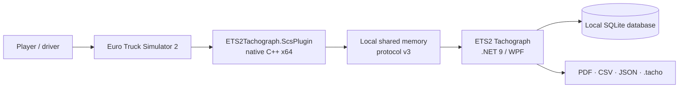
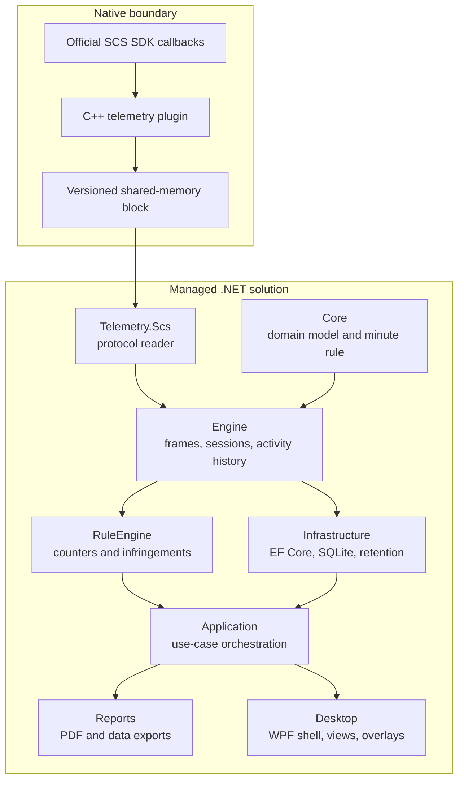
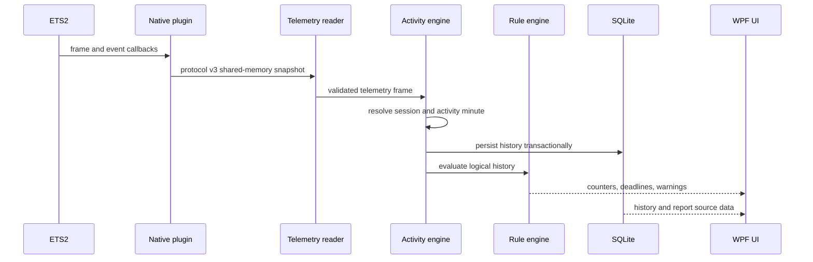

# Architecture

This document explains the public architecture of ETS2 EU Digital Tachograph.
It focuses on component boundaries, runtime data flow, and the design decisions
that protect activity history from game-time discontinuities.

## System context

The application is local-first. Telemetry, driver history, exports, logs, and
backups remain on the user's Windows machine.

## Component boundaries

### Native telemetry plugin

The x64 C++ plugin receives official SCS SDK events and publishes a compact
32-byte shared-memory block. Keeping this boundary small limits coupling
between the game's native callback model and the managed application.

### Telemetry reader and activity engine

`Telemetry.Scs` validates the protocol and converts shared memory into managed
frames. `Engine` interprets those frames, tracks world/session boundaries, and
reconstructs the logical driver-activity timeline.

### Domain and rules

`Core` contains shared domain concepts. `RuleEngine` derives counters and
infringements from activity history within the simulator's implemented rule
scope. It does not claim legal certification.

### Application, persistence, and presentation

`Application` coordinates use cases. `Infrastructure` owns EF Core, SQLite,
migrations, backups, and retention. `Reports` converts history into human- and
machine-readable outputs. `Desktop` provides the WPF dashboard, dialogs, and
independent in-game overlays.

## Runtime data flow

## Important invariants

- Game time, not the Windows clock, is the source of truth for activity.
- Frames with `running == 0` and invalid zero game time do not advance history.
- A `world_generation` change creates one shared session boundary for both
  driver cards.
- Clock rollback uses truncate-and-append semantics, so abandoned future data
  is not double-counted.
- The monotonic `highWaterMark` anchors retention; rolling the game clock back
  cannot make archived data recent again.
- The database stores minute-level truth for the active retention window, while
  presentation and older history may use aggregated activity blocks.

## Compatibility and failure handling

- The reader checks protocol version and reports an old plugin DLL explicitly.
- The database is backed up automatically before each migration.
- A single-instance guard prevents two desktop applications or monitors from
  writing concurrently.
- Diagnostic ZIP generation packages logs and runtime context for beta reports.

## Verification strategy

Eight test projects cover domain logic, telemetry, the activity engine,
application services, persistence, reports, rule evaluation, and desktop-facing
behaviour. GitHub Actions runs restore, Release build, all tests, and coverage
collection on `windows-latest` for pushes and pull requests.

See [Engineering case study](ENGINEERING_CASE_STUDY.md) for the reasoning behind
the most difficult design decisions.
