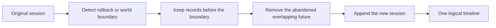

# Engineering case study

## Project

ETS2 EU Digital Tachograph is a Windows desktop simulator that converts live
Euro Truck Simulator 2 telemetry into driver-activity history, driving-time
counters, and printable reports. It combines a native C++ plugin with a layered
.NET 9/WPF application.

The project is a simulator, not a certified tachograph or a tool for real-world
working-time accounting.

## The engineering problem

The visible product looks like a dashboard, but the difficult work happens
behind it. The application must interpret a changing stream of game telemetry,
survive clock jumps and world reloads, preserve two drivers' histories, evaluate
time-based rules, and keep reports readable without discarding diagnostic data.

The key constraints were:

- ETS2 game time can jump forwards or backwards;
- the native plugin and managed reader can be deployed at different versions;
- one minute can affect several continuous, daily, weekly, and fortnightly
  counters;
- persistence must remain recoverable through schema changes;
- a useful report cannot simply print every stored minute.

## Challenge 1: reconstructing history after clock rollback

### Failure mode

Sleeping, console time changes, and some position corrections can move the game
clock backwards. A naïve append-only timeline either double-counts the abandoned
future or drops valid history before the rollback. One regression produced
`01:34` instead of the correct logical total of `05:27`.

### Design

The engine models history as sessions and composes the logical timeline with a
truncate-and-append operation:

The native protocol also publishes `world_generation`, which gives both card
slots the same explicit boundary even when the newly loaded game time is equal
to or later than the previous value.

### Result

Regression tests protect the `03:53 + 01:34 = 05:27` scenario and related edge
cases. The application can explain its logical history without silently
double-counting overlapping minutes.

## Challenge 2: keeping C++ telemetry and .NET compatible

### Failure mode

An old DLL can still produce plausible-looking telemetry. Without an explicit
contract, a stale plugin may look healthy while fields are interpreted with the
wrong layout.

### Design

The native and managed components communicate through a versioned, 32-byte
shared-memory protocol. The v3 contract includes:

- `world_generation` for timer/world restarts;
- `cargo_operation_generation` for controlled loading and unloading jumps;
- an explicit map name, `Local\ETS2Tachograph.Telemetry.v3`;
- a reader check for the older `.v2` map so it can report a clear mismatch.

This turns silent data corruption into a visible compatibility error.

### Result

The boundary is compact, testable, and independently versioned. Deployment
mistakes fail loudly instead of contaminating activity history.

## Challenge 3: retaining detail without producing unusable reports

### Failure mode

Minute-level storage is valuable for rules and diagnostics, but a direct PDF
render produced more than 40 pages for one game day.

### Design

The database remains the source of truth while read models use different
granularities:

- the latest 14 game days retain complete minute records for rule evaluation;
- older history is represented as continuous activity blocks;
- PDF output aggregates adjacent minutes into readable blocks;
- raw CSV remains minute-based for diagnostics;
- a monotonic `highWaterMark` prevents clock rollback from making archived data
  appear recent.

### Result

Human-facing reports remain compact, while diagnostic exports and active rule
evaluation retain the precision they need.

## Quality and release discipline

The solution has dedicated test projects for Core, Telemetry, Engine,
RuleEngine, Application, Infrastructure, Reports, and Desktop. The M6 release
gate recorded 570 passing tests, a Release build with no errors or warnings, and
no open P0/P1 defect at the final smoke checkpoint.

GitHub Actions now repeats the managed Release build and test suite for every
push and pull request, publishing TRX and Cobertura artifacts as independent
evidence.

## Trade-offs and next steps

Two files accumulated more responsibility than is comfortable:

- `MainViewModel` coordinates too many desktop features and should be split
  into shell, dashboard, driver-card, crew, manual-entry, rest, settings, and
  history view models;
- the broad repository implementation should be separated by driver, activity,
  session, gap, and retention concerns.

These are maintenance costs rather than hidden correctness claims. Documenting
them makes the next refactor deliberate and preserves the reasoning behind the
current release.

## What this project demonstrates

- modelling a complicated time-based domain;
- integrating native C++ with managed .NET;
- designing a versioned real-time data contract;
- transactional persistence and migration safety;
- regression testing of difficult temporal edge cases;
- turning diagnostic data into usable reports;
- shipping and documenting a Windows desktop release.
