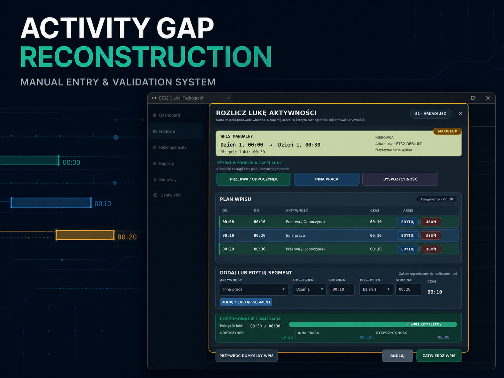
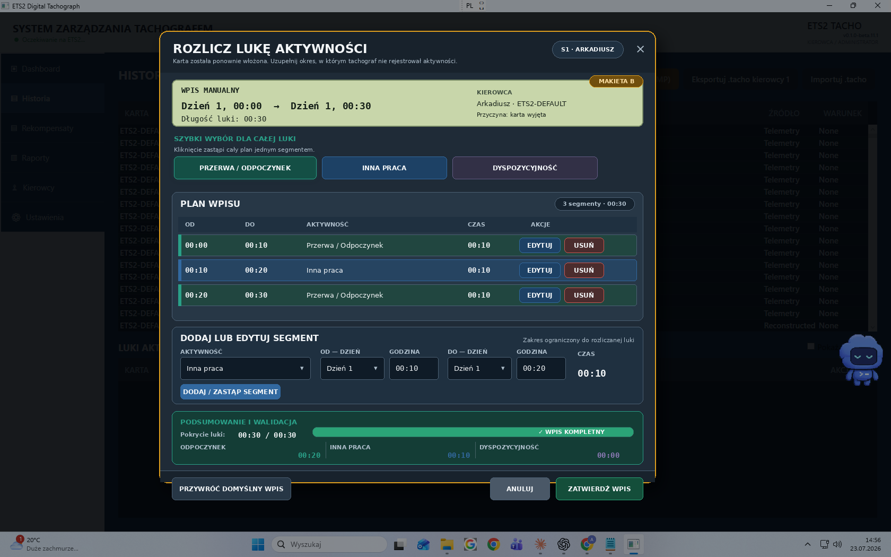

# Activity Gap Reconstruction & Manual Entry System

## Overview

Activity Gap Reconstruction is a data-editing and validation workflow developed
as part of the
[ETS2 EU Digital Tachograph](https://github.com/Staniek-Tech-NL/ETS2-EU-Digital-Tachograph)
desktop application. It detects periods for which the tachograph has no reliable
activity and allows the user to reconstruct the complete interval with audited
manual segments.

## Problem

Missing activity cannot safely be represented by a single default value. A gap
may be created when a driver card is removed, telemetry is unavailable, or game
time jumps forward. The missing interval may contain several kinds of activity,
and the reconstructed data later affects counters, rest classification, reports,
and violations.

The workflow therefore has to prevent:

- uncovered minutes or overlapping segments;
- segments outside the source gap;
- zero-length or negative intervals;
- unsupported manual activities such as driving;
- edits to an abandoned game-time branch;
- collisions with existing canonical history;
- two conflicting resolutions of the same gap;
- partial persistence that marks a gap resolved without saving its segments.

## Solution

The application models a manual entry as an ordered plan of typed segments. The
editor supports quick full-gap choices as well as precise add, replace, edit,
split, and delete operations. A live coverage summary shows whether every minute
has exactly one classification before the entry can be confirmed.

When the user confirms the plan, the application validates it again in the
service layer, links every new record to the source gap, and writes the complete
resolution in a database transaction. The canonical history is reloaded and the
rule engine is evaluated again from the persisted result.

## Key features

- detection of unresolved card-removal and time-jump gaps;
- quick classification of the entire gap;
- multi-segment editing for rest, other work, and availability;
- automatic range splitting and replacement in the editor;
- complete-coverage, overlap, bounds, and duration validation;
- canonical-branch and history-collision protection;
- source provenance through `ManualEntry` and `SourceGapId`;
- atomic SQLite persistence;
- idempotent handling of repeated identical submissions;
- explicit conflict handling for different second submissions;
- rule recalculation after a successful resolution;
- preservation of reconstructed provenance in history and reports.

## Technical approach

### Canonical history first

ETS2 game time can move backwards and create a new history branch. A raw stored
gap may therefore no longer belong to the logical timeline. Before editing or
saving, the repository resolves the gap against the canonical branch and tracks
projection ancestry when a rollback clipped the original interval.

### Defense-in-depth validation

The UI editor gives immediate feedback, but correctness does not depend on the
UI. `ManualEntryValidator` independently verifies the activity types, positive
durations, exact coverage, ordering, overlap, bounds, and collisions immediately
before persistence.

### Transactional and idempotent persistence

The resolution, generated activity records, source identifiers, and gap state
are committed in one Entity Framework Core transaction. Repeating the same
resolution returns an already-applied result; a different resolution returns a
conflict. This protects data when a command is retried or triggered twice.

### Traceable recalculation

Reconstructed records retain their source and gap identity. After the atomic
write, the service reloads canonical history and recalculates the regulatory
state, so daily resets and rest qualification occur at the reconstructed
activity boundary rather than at the time the user clicked Save.

## Verification

Tests cover gap creation, card removal, forward jumps, canonical projections,
editor range operations, validation failures, idempotency, transactional
persistence, restart behavior, and recalculation of the resulting rule state.
These tests span Engine, Application, Infrastructure, RuleEngine, and Desktop
boundaries.

## Technologies

- C# and .NET 9
- WPF and MVVM
- Entity Framework Core
- SQLite transactions
- domain validation and provenance modelling
- xUnit
- GitHub Actions

## Result

The module converts uncertain missing intervals into complete, validated, and
traceable activity history without hiding how the data was created. It
demonstrates state management, non-trivial editing UX, defense-in-depth
validation, transactional persistence, temporal-data modelling, and robust
handling of retries and history branches.

## Related project

- [Main repository](https://github.com/Staniek-Tech-NL/ETS2-EU-Digital-Tachograph)
- [Public architecture](../ARCHITECTURE.md)
- [Engineering case study](../ENGINEERING_CASE_STUDY.md)
