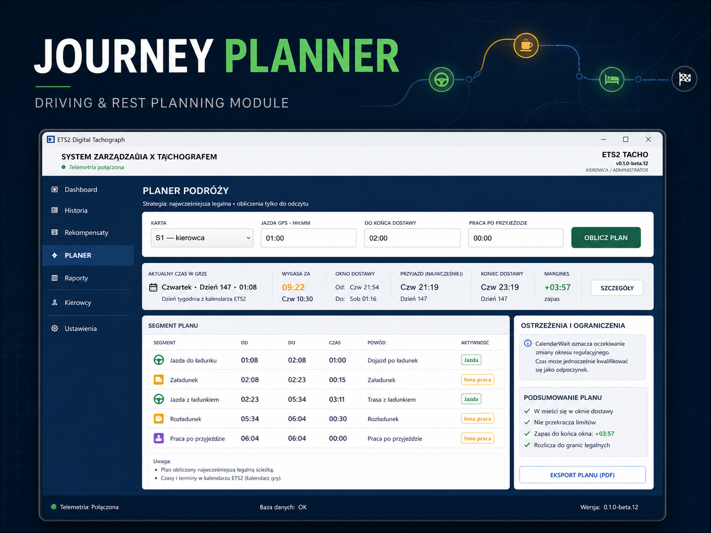
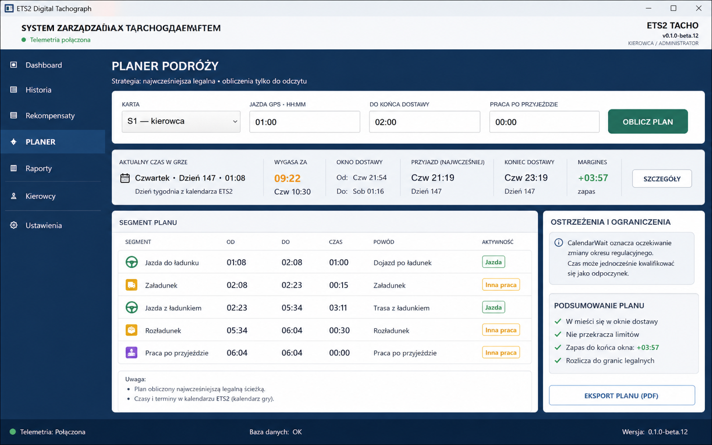

# Journey Planner — Driving & Rest Planning Module

## Overview

Journey Planner is a constraint-based planning module developed as part of the
[ETS2 EU Digital Tachograph](https://github.com/Staniek-Tech-NL/ETS2-EU-Digital-Tachograph)
desktop application. It converts a driver's current tachograph state and a
delivery target into an explainable sequence of driving, breaks, rests, calendar
waits, and operational work.

The module is deliberately read-only: it evaluates a snapshot of the current
state and never mutates the driver's recorded activity history.

## Problem

A route duration alone is not enough to answer whether a delivery is feasible.
The calculation must account for several interacting constraints:

- continuous, daily, weekly, and fortnightly driving capacity;
- 45-minute breaks, including completion of an existing split break;
- regular and reduced daily rest;
- weekly-rest deadlines and reduced-rest compensation awareness;
- regulatory week boundaries and restored driving capacity;
- delivery windows and post-arrival operational work;
- stale telemetry or unresolved activity gaps that reduce confidence.

A useful result also needs to explain *why* each non-driving segment was added.

## Solution

The planner captures an immutable snapshot containing the selected driver's
rule evaluation, canonical activity history, unresolved gaps, game time, world
generation, and session identity. A deterministic planning engine advances that
state one segment at a time and chooses the earliest supported continuation.

Each output segment contains its time range, activity, driver slot, reason, and
information about any supported exception. The result includes the earliest
arrival, completion time, deadline margin, warnings, confidence, and a usage
summary.

The image above is the UI design mockup used to shape the implemented planner.
Its PDF-export control remained outside the current release scope; the portfolio
does not claim that feature as shipped.

## Key features

- earliest supported driving-and-rest plan from the current driver state;
- continuous, daily, weekly, and fortnightly capacity checks;
- regular and reduced daily-rest scheduling;
- weekly-rest scheduling and compensation-obligation awareness;
- split-break completion and calendar-boundary waiting;
- delivery deadline and post-arrival work calculation;
- single-driver and crew-planning domain contracts;
- explicit statuses for insufficient data, unresolved gaps, stale snapshots,
  missed deadlines, and calculation safety limits;
- explainable plan segments and warnings;
- desktop presentation of the calculated segment timeline.

## Technical approach

### Snapshot isolation

Planning runs against a captured state instead of live mutable objects. The
snapshot identity combines the driver slot, activity session, world generation,
game-time position, history high-water mark, and regulatory calendar offset.
The application checks that identity again before presenting a result. If the
card, session, activity, gap state, or telemetry position changed during the
calculation, the result is marked stale rather than presented as current.

### Deterministic state transition engine

The core algorithm advances through typed segments such as `Drive`, `Break`,
`DailyRest`, `WeeklyRest`, `OtherWork`, and `CalendarWait`. Each transition
updates the relevant counters and deadlines. This keeps the calculation
auditable and makes edge cases testable without the UI.

### Bounded calculation

Maximum segment, elapsed-time, and visited-state limits protect the desktop
application from unbounded searches. Repeated states are detected, and the
planner returns an explicit terminal status instead of hanging or guessing.

### Presentation boundary

The WPF view model translates domain segments, warnings, confidence, and
deadline margins into a readable timeline. Planning logic remains independent
of controls and formatting.

## Verification

Dedicated RuleEngine, Application, and Desktop tests cover the algorithm,
contracts, safety limits, stale-snapshot handling, delivery planning, crew
boundaries, and view-model behavior. The wider solution is continuously built
and tested in GitHub Actions.

## Technologies

- C# and .NET 9
- WPF and MVVM
- deterministic domain modelling
- SQLite and Entity Framework Core as the history source
- xUnit
- GitHub Actions

## Result

The module turns a complex time-based state into a plan that a user can inspect:
when driving can continue, when rest is required, which constraint caused a
wait, and whether the delivery window is still achievable. From a portfolio
perspective, it demonstrates algorithmic business logic, safe state handling,
clear separation between domain and UI, and regression-driven development.

## Related project

- [Main repository](https://github.com/Staniek-Tech-NL/ETS2-EU-Digital-Tachograph)
- [Public architecture](../ARCHITECTURE.md)
- [Engineering case study](../ENGINEERING_CASE_STUDY.md)
