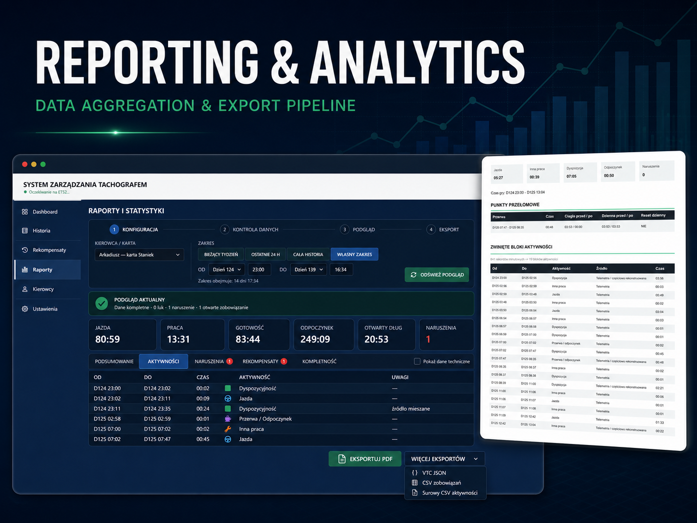
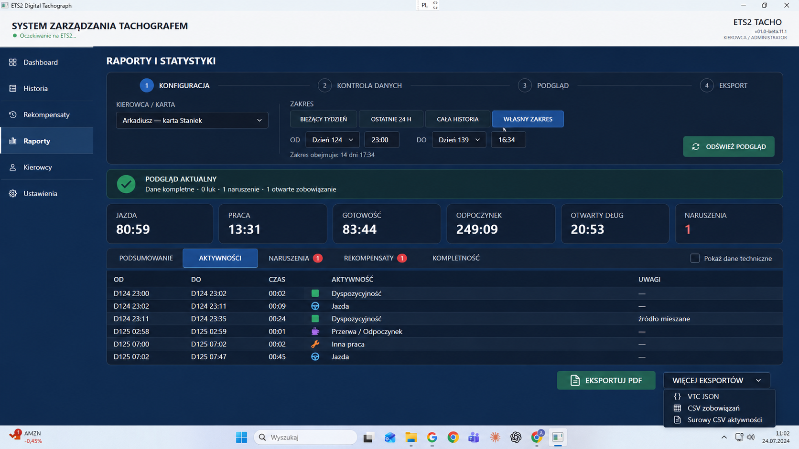

# Reporting, Analytics & Export Pipeline

## Overview

Reporting & Analytics is a data-processing and export module developed as part
of the
[ETS2 EU Digital Tachograph](https://github.com/Staniek-Tech-NL/ETS2-EU-Digital-Tachograph)
desktop application. It turns canonical driver history into readable summaries,
completeness checks, violations, compensation information, and human- or
machine-readable exports.

## Problem

The application stores detailed activity data because rule evaluation and
diagnostics need precise time boundaries. Presenting every minute directly,
however, produced reports longer than 40 pages for a single game day.

The reporting layer also has to answer whether a selected period is complete.
A total that ignores unresolved gaps may look precise while being unsupported,
and aggregated output must retain enough provenance to distinguish telemetry
from reconstructed activity.

## Solution

The reporting service loads canonical records and unresolved canonical gaps for
a selected driver and game-time range. It clips both to the requested interval,
calculates activity totals, analyzes violations and rest compensation, and
builds explicit coverage and completeness indicators.

The presentation layer aggregates adjacent minute records into activity blocks
for the PDF while the raw CSV export continues to expose minute-level diagnostic
data. JSON provides a structured integration format, and a checksum-protected
`.tacho` envelope supports application data exchange.

## Key features

- presets and custom game-time ranges;
- totals for driving, other work, availability, rest, and OUT activity;
- timeline blocks with source provenance;
- unresolved-gap count and duration;
- coverage equation for activity, gaps, and selected range;
- evidence-completeness status;
- violations and weekly-rest compensation information;
- readable PDF generation;
- raw activity CSV for diagnostics;
- compensation-obligation CSV;
- VTC JSON with totals, completeness, violations, gaps, and activities;
- checksum-protected `.tacho` export and import format;
- localized report resources for Polish and English.

## Technical approach

### Canonical range projection

Reports use the same logical history as the rule engine. Records and unresolved
gaps are loaded from the canonical game-time branch and clipped to the requested
range, preventing abandoned rollback data from reappearing in totals.

### Explicit completeness model

The report DTO exposes activity minutes, unresolved-gap minutes, covered minutes,
range minutes, balance status, pending rest-allocation status, and a final
`EvidenceComplete` flag. Completeness is therefore a first-class result rather
than an assumption inferred from a successful export.

### Separate truth from presentation

Minute-level data remains available for rules and diagnostic CSV. The PDF
presentation builder collapses adjacent compatible records into continuous
blocks and inserts unresolved gaps into the timeline. This keeps the document
readable without discarding the detailed source data.

### Format-specific outputs

The PDF is designed for people; CSV exposes a stable diagnostic table; VTC JSON
provides structured nested data; and `.tacho` preserves sessions, gaps, source
links, and a SHA-256 checksum. The formats share a source model but are not
forced into the same presentation shape.

## Verification

Application tests verify totals, ranges, gaps, completeness, violations, and
export behavior. Report tests verify block aggregation, unresolved-gap
presentation, reconstructed-source handling, localization, and PDF generation.
Infrastructure tests protect canonical history and retention behavior.

## Technologies

- C# and .NET 9
- WPF and MVVM
- Entity Framework Core and SQLite
- PDFsharp
- CSV and `System.Text.Json`
- SHA-256 export integrity
- xUnit
- GitHub Actions

## Result

The module keeps user-facing reports compact while preserving detailed evidence
for diagnostics and integrations. It demonstrates data aggregation, temporal
range processing, completeness modelling, multi-format serialization,
localization, and a clean boundary between stored truth and presentation.

## Related project

- [Main repository](https://github.com/Staniek-Tech-NL/ETS2-EU-Digital-Tachograph)
- [Public architecture](../ARCHITECTURE.md)
- [Engineering case study](../ENGINEERING_CASE_STUDY.md)
